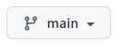

# Octopus Deploy Training Workshop Repo

See [the wiki page](https://octopushq.atlassian.net/wiki/spaces/SCS/pages/2506523074/Octopus+Basics+Workshop+101) for this workshop for more details.

## Here as a student? 
- Make sure you are on your student branch. Use the branch selector above the files list to change it. The selector looks like this:

- Please visit the [Workshop Instructions page](instructions/README.md) to see your customized instructions.

## Looking for admin stuff?

Visit the [admin folder](admin) for more.