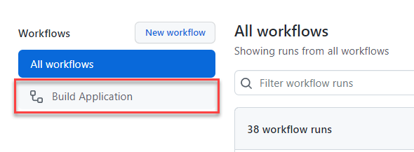
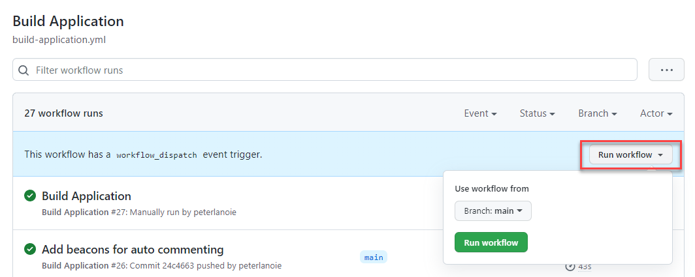
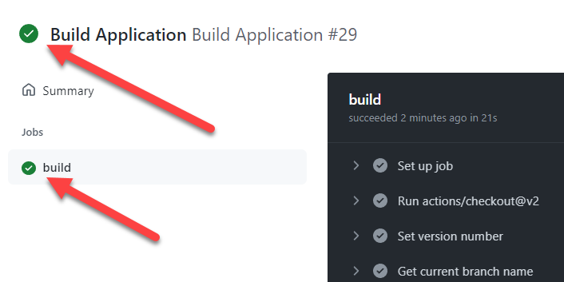

# Part 1 - Lesson 1: Application build and artifacts
- Time: ~15 min

[Presentation Slides](https://docs.google.com/presentation/d/1RE1cpKfioSquK9h-HH6jxqrbRpw4WQff4TxOJTCD2ww/edit#slide=id.g1185db482c1_0_8)

## Objectives
- Understand a basic example of where an application comes from
- Understand what kind of artifact results from an application build
- Understand where that artifact goes

## Tasks
- Show empty artifact feed
- Run a predefined application build in GitHub actions
- Verify the package is in your Octopus Deploy artifact feed

## Achievement
- The application package is visible in your Octopus package library

# Exercise

## Show empty artifact feed

- Visit your Octopus Space package repository: https://octopus-training.octopus.app/app#/Spaces-405/library

From your Space, you'll find this under `Library` > `Packages`.


- Note that your `Built-in Package Repository` currently contains no packages.

## Run application build workflow

### Navigate to the GitHub Action workflow

From this instructions page, go to the top to find the GitHub repository top menu

- Click on the `Actions` tab (open in a new browser tab so you don't lose your instructions)


- Under `All workflows` click on `Build Application`



(Or visit the `Build Application` workflow directly: https://github.com/OctopusDeploy/training-workshop/actions/workflows/build-application.yml)

From the `Build Application` workflow view

- Click `Run workflow`. A small dialog will open.
- ***IMPORTANT!***: Look for and select your branch name from the `Use workflow from` dropdown: `student/Z-Student-96ee26db`





Once your student branch is selected

- Click `Run workflow`


After a short time, you should see a new workflow run show up in the run list with your GitHub username listed.
```
Manually run by {your username}
```


- Click on the `Build Application` title for the entry with your name

- Click on the block labeled `build`


You should now see the activity log of the running application build.


Once everything is finished running, the build should indicate that it's completed and good.



- Look in the details and expand the `Push Sample App Package` section
- Following a line with a green checkmark, you should see `Pushing package: ...`. This is the build artifact being sent to Octopus.

## Verify the artifact in your package feed

- Return to your Octopus Space package repository: https://octopus-training.octopus.app/app#/Spaces-405/library

- Verify that you have a package entry called `workshop-app`.


# Lesson Completed!

On to the next lesson: [Infrastructure and Environments](part-1-lesson-2.md)
