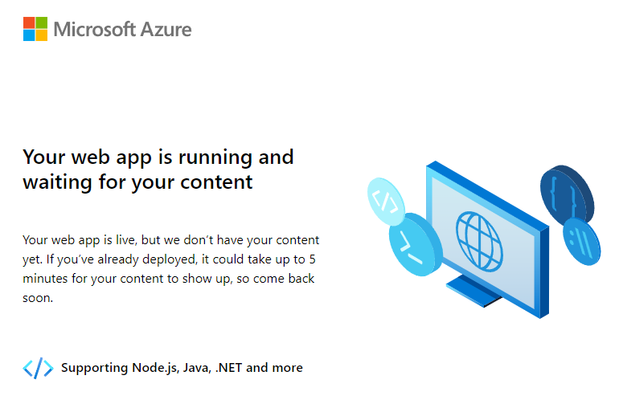

# Part 1 - Lesson 2: Infrastructure and Environments
- Time: ~45 - 60 min

## Objective
- Understand the concept of “infrastructure awareness”
- Understand the purpose of different deployment environments
- Understand the purpose of target roles
- Configure your deployment environments and targets

## Tasks
- Verify that your workshop apps are running
- Create the three typical runtime environments
- Register the deployment targets

## Achievement
- Targets are configured and visible in the overview

# Lesson

## Verify web apps are running

- Browse to each of your 3 web sites
  - Development: [student-app-url-dev]
  - Test: [student-app-url-test]
  - Production: [student-app-url-prod]
- Verify that each is running with the default Azure web service application. They might look something like this:

## Create environments

- In Octopus Deploy, navigate to `Infrastructure` > `Environments`

You can get there directly: https://octopus-training.octopus.app/app#/[space-id]/infrastructure/environments

- Click `Add Environment` button
- In the `Add environment` dialog box, click the `Development` link
- Click `Save`
- Click `Add Deployment Target` button
- Click `Azure`
- Click `Add` button over the `Azure Web App` box
- Enter a display name such as `Azure Dev Service`
- Verify the `Environments` section already has `Development` in it.
- Enter the target role: `workshop-app-service`
- Click `"workshop-app-service" (add new role)`
- Under `Account` section, click the dropdown and select `Workshop Azure Account`
- Under `Azure Web App`, click the dropdown and select the item that starts with: `[student-slug]-dev` (this is *your* development environment app service)
- Click `Save` button

## Verify infrastructure

- From the top Octopus menu, click `Infrastructure`
- Verify your Overview contains the following:
  - Environments (1)
    - Development 1
  - Deployment Targets (1)
    - Azure Web App 1
  - Target Status (1)
    - Healthy 1
  - Target Roles (1)
    - `workshop-app-service`

# Lesson Complete
On to the next lesson: [Project Setup and First Deployment](part-1-lesson-3.md)