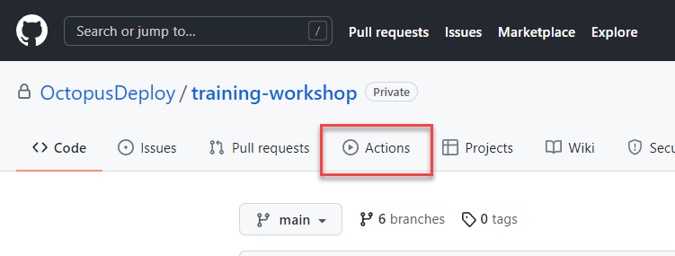
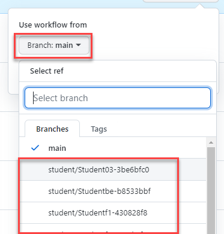
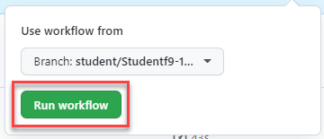
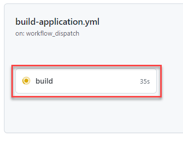
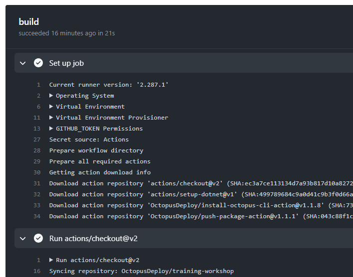
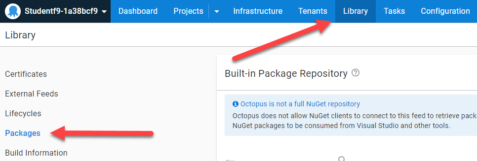

# Part 1 - Lesson 1: Application build and artifacts
- Time: ~30 - 45 min

## Objective
- Understand a basic example of where an application comes from
- Understand what kind of artifact results from an application build
- Understand where that artifact goes

## Task
- You will run a predefined application build in GitHub actions which will push the build artifact to your Octopus Deploy artifact feed.

## Achievement
- The application package is visible in your Octopus package library.

# Lesson

## Run workflow

### Navigate to the GitHub Action workflow

From the repository home location

- Click on the `Actions` tab



- Click on `Build Application`


(Or visit the workflow directly: https://github.com/OctopusDeploy/training-workshop/actions/workflows/build-application.yml)

From the `Build Application` workflow view

- Click `Run workflow`. A small dialog will open.


- (***IMPORTANT!***): Select your branch name from the `Use workflow from` dropdown.
- Look for your student branch name: `student/[student-slug]`



Once your student branch is selected, you can

- Click `Run workflow`



After a short time, you should see a new workflow run show up in the run list with your name listed.
```
Manually run by {you name}
```


- Click on the `Build Application` title for the entry with your name

- Click on the block labeled `build`



You should now see the activity log of the running application build.



Once everything is finished running, the build should indicate that it's completed and good.


## Verify the artifact in package feed

Visit your Octopus Space package repository: https://octopus-training.octopus.app/app#/[space-id]/library/builtinrepository

From your Space, you'll find this under `Library` > `Packages`.



Verify that you have a package entry with a `Highest version` that has a number with this pattern:
```
{year}.{month}.{day}.{workflow run number}
```


# Lesson Completed!

On to [Lesson 2](part-1-lesson-2.md)